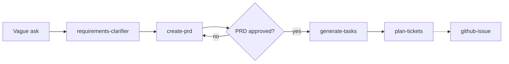
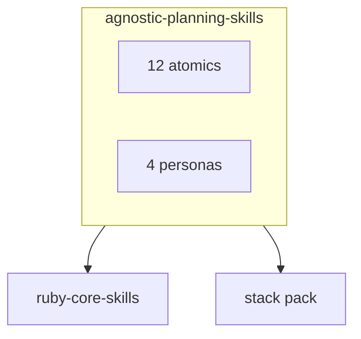

# Agnostic Planning Skills

12 language-agnostic planning skills and 4 personas. Agents use them to write PRDs, break down work, estimate, rank a backlog, plan a sprint, run a retro, and track execution — without tying the process to a stack.

```text
No implementation without an approved PRD. The PRD is the single source of truth for scope.
```

Process skills (TDD gates, review, DDD) live in [`ruby-core-skills`](https://github.com/igmarin/ruby-core-skills). After a plan is approved, hand off to a stack pack such as [`rails-agent-skills`](https://github.com/igmarin/rails-agent-skills).





Also in the same ecosystem: [`hanakai-yaku`](https://github.com/igmarin/hanakai-yaku), [`agent-mcp-runtime`](https://github.com/igmarin/agent-mcp-runtime), [`ruby-skill-bench`](https://github.com/igmarin/ruby-skill-bench).

## Catalog

| Skill | Area |
|-------|------|
| `create-prd`, `review-prd` | PRD |
| `generate-tasks`, `plan-tickets`, `estimate-tasks` | Task management |
| `prioritize-backlog` | Backlog |
| `plan-sprint`, `create-retrospective` | Ceremony |
| `identify-risks`, `generate-status-report` | Execution |
| `requirements-clarifier` | Analysis |
| `github-issue` | GitHub issues |
| `product-owner`, `project-manager`, `tech-lead`, `delivery-lead` | Personas |

Full list: [docs/reference/skill-catalog.md](docs/reference/skill-catalog.md). Gaps: [docs/reference/gaps.md](docs/reference/gaps.md).

Name a persona when you want the whole chain: `product-owner` (scope → tickets), `tech-lead` (feasibility), `project-manager` (execution health), `delivery-lead` (PRD through retro).

## Install

There is **no** root `SKILL.md`. The catalog lives at `skills/agnostic-planning-skills/`. Each folder under `skills/` is its own skill, so the CLI can prompt for **all** or **one**.

```bash
# picker: all skills, or a subset
npx skills add igmarin/agnostic-planning-skills

# all skills, skip prompts
npx skills add igmarin/agnostic-planning-skills --skill '*'

# one skill
npx skills add igmarin/agnostic-planning-skills --skill create-prd
```

Or with GitHub CLI v2.90.0+ (`gh skill`):

```bash
gh skill install igmarin/agnostic-planning-skills
gh skill install igmarin/agnostic-planning-skills create-prd --scope project
```

## Docs

| Need | Document |
|------|----------|
| Host context | [AGENTS.md](AGENTS.md) |
| How to invoke a persona | [docs/persona-guide.md](docs/persona-guide.md) |
| Skill layout | [docs/architecture.md](docs/architecture.md) |
| How skills chain | [docs/reference/integration-matrix.md](docs/reference/integration-matrix.md) |

## Contributing

- Artifacts in English unless the user asks otherwise.
- Keep the PRD-before-implementation gate.
- `description` is when + triggers (≤ 600 chars). Procedure stays in the body.
- Keep public docs in sync with `directory.json`.
