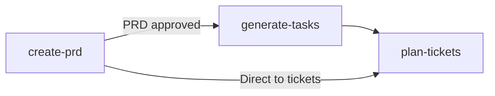
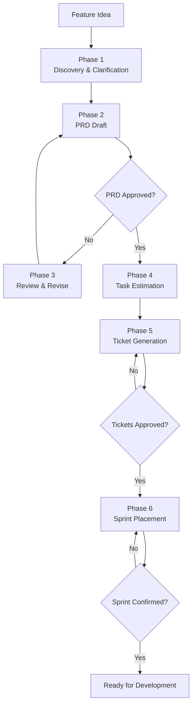

# Agnostic Planning Skills

**Agnostic Planning Skills turns AI coding assistants into disciplined product collaborators.**

It is a curated library of **3 language-agnostic planning skills** and **1 orchestration agent** that teach AI tools how to write PRDs, break down features into TDD tasks, and generate tracker-ready tickets — regardless of tech stack.

The project is built around one non-negotiable rule:

```text
No implementation without an approved PRD. The PRD is the single source of truth for scope.
```

That planning gate is encoded directly into the skills and agent, so agents do not just produce plausible plans. They follow a repeatable product management process.

> Supported agent environments
>
> [](#)
> [](#)
> [](#)
> [](#)
> [](#)
> [](#)
> [](#)

> [](LICENSE)

## Who This Is For

| Reader | What you get |
| Product Managers | AI-assisted PRD generation with structured templates and approval gates. |
| Tech Leads | A repeatable planning pipeline that produces TDD task checklists from approved scope. |
| Developers | Step-by-step task breakdown with exact file paths and test-first discipline. |
| Teams | Sprint-ready tickets with classification, dependencies, and sequencing guidance. |

## What Is In The Repository

| Area | Purpose |
|------|---------|
| `skills/` | 3 language-agnostic skills: `create-prd`, `generate-tasks`, `plan-tickets`. |
| `agents/` | 1 orchestration agent: `product-owner` — chains all 3 skills through 6 phases with approval gates. |
| `docs/` | Architecture, skill structure, agent guide, templates, and reference catalog. |

The skills are not long-form tutorials. They are executable instructions for AI agents: when to draft a PRD, when to stop for approval, how to break down a feature into TDD tasks, and how to classify and sequence tickets.

## Start Here

Agnostic Planning Skills can be invoked through chat commands:

| Method | Syntax | Example |
|--------|--------|---------|
| **Chat Command** | `@skill-name` | `@create-prd Add Google OAuth login` |

> MCP support is planned but not yet implemented. Currently, skills are invoked via chat commands (`@skill-name` in Cursor, Windsurf, Gemini CLI) or installed via `gh skill install`.

**[Read the complete guide on Calling Skills and Agents](docs/calling-skills.md)** for syntax examples and when to use each method.

## The Planning Pipeline



### For a new feature from scratch:

```text
create-prd -> [gate: PRD approved] -> generate-tasks -> plan-tickets
```

### The full product-owner agent lifecycle:



## Skill Catalog

| Skill | Category | Description |
|-------|----------|-------------|
| `create-prd` | PRD | Generate structured Product Requirements Documents |
| `generate-tasks` | Task Management | Break features into TDD task checklists with auto-detected paths |
| `plan-tickets` | Task Management | Draft tracker-ready tickets with classification and sequencing |

### Agent

| Agent | Description |
|-------|-------------|
| `product-owner` | Full planning lifecycle: Discovery → PRD → Tasks → Tickets → Sprint |

See [docs/reference/skill-catalog.md](docs/reference/skill-catalog.md) for the complete catalog and [docs/reference/integration-matrix.md](docs/reference/integration-matrix.md) for skill chaining.

## How Skills Work

Each skill is a single `SKILL.md` file with YAML frontmatter and a 6-section body:

```text
1. Frontmatter (YAML)       — name, description, metadata
2. Quick Reference          — scannable table for fast lookup
3. HARD-GATE               — non-negotiable blocking rules
4. Core Process             — step-by-step procedure
5. Output Style             — exact shape of artifacts
6. Integration              — predecessor/successor skills
```

The `product-owner` agent chains skills with additional phases, hard gates, decision gates, and error recovery.

## Language-Agnostic by Design

This repository is designed to work with any tech stack. Skills auto-detect project conventions:

- **Test command:** Inspects `package.json`, `Gemfile`, `Cargo.toml`, `Makefile`, or `pyproject.toml` — falls back to asking the user.
- **Source directory:** Detects `src/`, `lib/`, `app/`, or asks the user.
- **Test directory:** Detects `__tests__/`, `spec/`, `test/`, `tests/`, or mirror convention.
- **Documentation tool:** Detects JSDoc, YARD, Sphinx, rustdoc, etc.

## Install Selected Skills With GitHub CLI

Requires [GitHub CLI](https://cli.github.com/) v2.90.0+ with `gh skill`.

```bash
# Install all skills interactively
gh skill install igmarin/agnostic-planning-skills

# Install a specific skill for the current project
gh skill install igmarin/agnostic-planning-skills create-prd --scope project

# Install a specific skill globally
gh skill install igmarin/agnostic-planning-skills create-prd --scope user
```

## Install With skills.sh

Requires [skills.sh](https://www.skills.sh/) CLI.

```bash
npx skills add igmarin/agnostic-planning-skills
```

## Documentation Map

| Need | Document |
| Understand the docs system | [docs/index.md](docs/index.md) |
| Browse all skills | [docs/reference/skill-catalog.md](docs/reference/skill-catalog.md) |
| Understand skill chaining | [docs/reference/integration-matrix.md](docs/reference/integration-matrix.md) |
| Follow agent guides | [docs/agent-guide.md](docs/agent-guide.md) |
| Understand repository structure | [docs/architecture.md](docs/architecture.md) |
| Create a new skill | [docs/skill-template.md](docs/skill-template.md) |
| Create a new agent | [docs/agent-template.md](docs/agent-template.md) |
| Invoke skills and agents | [docs/calling-skills.md](docs/calling-skills.md) |

## Contributing

When contributing skills, agents, or docs:

- Keep generated artifacts in English unless a user explicitly asks for another language.
- Preserve the PRD-gates-task-generation rule for every planning skill.
- Keep public docs consistent with `tile.json`, `agents.json`, and the latest release.
