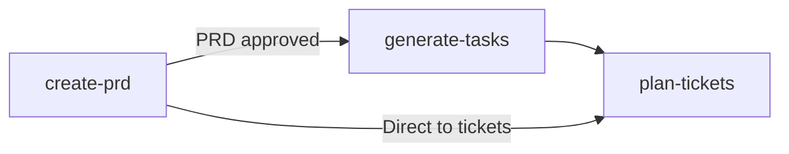
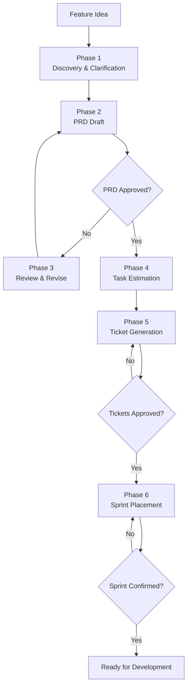

# Agnostic Planning Skills


**Agnostic Planning Skills turns AI coding assistants into disciplined product collaborators.**

It is a curated library of **10 language-agnostic planning skills** and **4 orchestration agents** that teach AI tools how to write and review PRDs, break down features into TDD tasks, estimate effort, identify risks, prioritize backlogs, plan sprints, run retrospectives, generate status reports, and create tracker-ready tickets — regardless of tech stack.

The project is built around one non-negotiable rule:

```text
No implementation without an approved PRD. The PRD is the single source of truth for scope.
```

That planning gate is encoded directly into the skills and agent, so agents do not just produce plausible plans. They follow a repeatable product management process.

## Part of the AI Skill Ecosystem

This repo is one of 6 in a composable AI skill ecosystem:

| Repo | Role |
|------|------|
| [`ruby-core-skills`](https://github.com/igmarin/ruby-core-skills) | 15 shared Ruby skills + process discipline |
| [`rails-agent-skills`](https://github.com/igmarin/rails-agent-skills) | 28 Rails-specific skills + 9 agents |
| [`hanakai-yaku`](https://github.com/igmarin/hanakai-yaku) | 35 Hanami/dry-rb skills + 10 agents |
| [**`agnostic-planning-skills`**](https://github.com/igmarin/agnostic-planning-skills) | 10 planning skills + 4 agents |
| [`agent-mcp-runtime`](https://github.com/igmarin/agent-mcp-runtime) | Rust CLI runtime (pack resolution, MCP) |
| [`ruby-skill-bench`](https://github.com/igmarin/ruby-skill-bench) | Benchmark/eval engine |

See the [Ecosystem Overview](https://github.com/igmarin/agent-mcp-runtime/blob/main/docs/ecosystem.md) for the full architecture.

> Supported agent environments
>
> [](#)
> [](#)
> [](#)
> [](#)
> [](#)
> [](#)
> [](#)

> [](https://github.com/igmarin/agnostic-planning-skills/pulls)
> [](LICENSE)
> [](https://skills.sh/igmarin/agnostic-planning-skills)
> [](https://tessl.io/registry/igmarin/agnostic-planning-skills)
> 

## Who This Is For

| Reader | What you get |
|--------|-------------|
| Product Managers | AI-assisted PRD generation, backlog prioritization, and sprint planning. |
| Tech Leads | Risk assessment, estimation quality review, and technical feasibility checks. |
| Developers | Step-by-step task breakdown, TDD checklists, and effort estimation. |
| Teams | Execution tracking, status reports, sprint-ready tickets with classification. |

## What Is In The Repository

| Area | Purpose |
|------|---------|
| `skills/` | 10 language-agnostic skills across 5 categories: prd, task-management, backlog, ceremony, execution. |
| `agents/` | 4 orchestration agents: `product-owner`, `project-manager`, `tech-lead`, `delivery-lead`. |
| `docs/` | Architecture, skill structure, agent guide, templates, and reference catalog. |

The skills are not long-form tutorials. They are executable instructions for AI agents: when to draft a PRD, when to stop for approval, how to break down a feature into TDD tasks, and how to classify and sequence tickets.

## Start Here

Agnostic Planning Skills can be invoked through chat commands:

| Method | Syntax | Example |
|--------|--------|---------|
| **Chat Command** | `@skill-name` | `@create-prd Add Google OAuth login` |

> MCP support is planned but not yet implemented. Currently, skills are invoked via chat commands (`@skill-name` in Cursor, Windsurf, Gemini CLI) or installed via `gh skill install`.

**[Read the complete guide on Calling Skills and Agents](docs/calling-skills.md)** for syntax examples and when to use each method.

## The Planning Pipeline



### For a new feature from scratch

```text
create-prd -> [gate: PRD approved] -> generate-tasks -> plan-tickets
```

### The full product-owner agent lifecycle



## Skill Catalog

| Skill | Category | Description |
|-------|----------|-------------|
| `create-prd` | PRD | Generate structured Product Requirements Documents |
| `review-prd` | PRD | Review PRDs for completeness, testability, and technical feasibility |
| `generate-tasks` | Task Management | Break features into TDD task checklists with auto-detected paths |
| `plan-tickets` | Task Management | Draft tracker-ready tickets with classification and sequencing |
| `estimate-tasks` | Task Management | Assign story points, t-shirt sizes, or time estimates with confidence levels |
| `prioritize-backlog` | Backlog | Rank backlog items by RICE, MoSCoW, value-vs-effort, or WSJF |
| `plan-sprint` | Ceremony | Plan a sprint: select tickets, define goal, allocate capacity |
| `create-retrospective` | Ceremony | Generate sprint retrospectives with action items |
| `identify-risks` | Execution | Scan plans for dependency, capacity, and technical risks |
| `generate-status-report` | Execution | Generate stakeholder status reports with honest progress tracking |

### Agent

| Agent | Description |
|-------|-------------|
| `product-owner` | Planning lifecycle: Discovery → PRD → Tasks → Tickets → Sprint |
| `project-manager` | Execution tracking: Estimation → Risks → Tracking → Status Reports |
| `tech-lead` | Technical review: PRD Review → Feasibility → Estimation Quality → Risk Report |
| `delivery-lead` | End-to-end pipeline: Scope → Plan → Prioritize → Sprint → Execute → Retrospect |

See [docs/reference/skill-catalog.md](docs/reference/skill-catalog.md) for the complete catalog and [docs/reference/integration-matrix.md](docs/reference/integration-matrix.md) for skill chaining.

## How Skills Work

Each skill is a single `SKILL.md` file with YAML frontmatter and a 6-section body:

```text
1. Frontmatter (YAML)       — name, description, metadata
2. Quick Reference          — scannable table for fast lookup
3. HARD-GATE               — non-negotiable blocking rules
4. Core Process             — step-by-step procedure
5. Output Style             — exact shape of artifacts
6. Integration              — predecessor/successor skills
```

The `product-owner` agent chains skills with additional phases, hard gates, decision gates, and error recovery.

## Language-Agnostic by Design

This repository is designed to work with any tech stack. Skills auto-detect project conventions:

- **Test command:** Inspects `package.json`, `Gemfile`, `Cargo.toml`, `Makefile`, or `pyproject.toml` — falls back to asking the user.
- **Source directory:** Detects `src/`, `lib/`, `app/`, or asks the user.
- **Test directory:** Detects `__tests__/`, `spec/`, `test/`, `tests/`, or mirror convention.
- **Documentation tool:** Detects JSDoc, YARD, Sphinx, rustdoc, etc.

## Install Selected Skills With GitHub CLI

Requires [GitHub CLI](https://cli.github.com/) v2.90.0+ with `gh skill`.

```bash
# Install all skills interactively
gh skill install igmarin/agnostic-planning-skills

# Install a specific skill for the current project
gh skill install igmarin/agnostic-planning-skills create-prd --scope project

# Install a specific skill globally
gh skill install igmarin/agnostic-planning-skills create-prd --scope user
```

## Install With skills.sh

Requires [skills.sh](https://www.skills.sh/) CLI.

> [!IMPORTANT]
> Because this repository has a root-level `SKILL.md`, you **must** include the `--full-depth` flag so the CLI scans and discovers all the nested skills.

### Project-Level Installation (Local)

To install skills for your current project workspace:

```bash
# Install ALL skills and agents
npx skills add igmarin/agnostic-planning-skills --full-depth --all

# Install a specific skill (e.g., create-prd)
npx skills add igmarin/agnostic-planning-skills@create-prd --full-depth
```

### Global Installation

To install skills globally for your AI coding assistant:

```bash
# Install ALL skills and agents globally
npx skills add igmarin/agnostic-planning-skills --full-depth --all --global

# Install a specific skill globally (e.g., create-prd)
npx skills add igmarin/agnostic-planning-skills@create-prd --full-depth --global
```

## Documentation Map

| Need | Document |
|------|----------|
| Understand the docs system | [docs/index.md](docs/index.md) |
| Browse all skills | [docs/reference/skill-catalog.md](docs/reference/skill-catalog.md) |
| Understand skill chaining | [docs/reference/integration-matrix.md](docs/reference/integration-matrix.md) |
| Follow agent guides | [docs/agent-guide.md](docs/agent-guide.md) |
| Understand repository structure | [docs/architecture.md](docs/architecture.md) |
| Invoke skills and agents | [docs/calling-skills.md](docs/calling-skills.md) |

## Contributing

When contributing skills, agents, or docs:

- Please follow the [Code of Conduct](CODE_OF_CONDUCT.md) in all interactions.
- Check out the [Contributing Guide](CONTRIBUTING.md) for details on our development and pull request processes.
- Keep generated artifacts in English unless a user explicitly asks for another language.
- Preserve the PRD-gates-task-generation rule for every planning skill.
- Keep public docs consistent with `tile.json`, `agents.json`, and the latest release.
