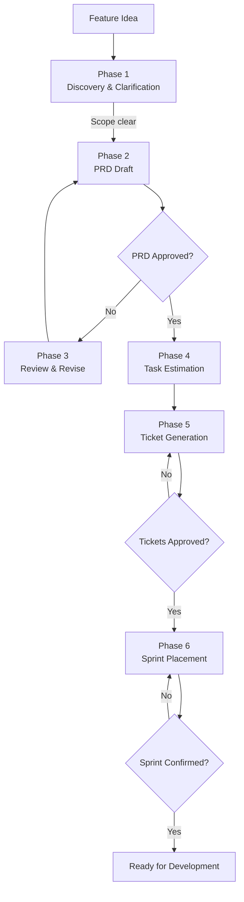
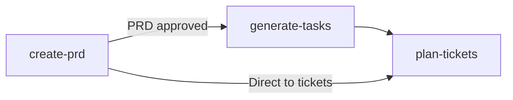

# Agent Guide — Agnostic Planning Skills

Step-by-step workflow for the `product-owner` orchestration agent.

---

## Product Owner Agent

Orchestrates the full product planning lifecycle: from a feature idea to sprint-ready tickets. Chains three skills through six phases with explicit approval gates.

### Phase Flow

### Phase 1: Discovery & Clarification

**Objective:** Establish clear scope, goals, and constraints.

1. Receive the feature description or product idea.
2. Ask 3-5 targeted questions only if scope is ambiguous.
3. Confirm priorities, constraints, and explicit non-goals.
4. Proceed when scope is unambiguous.

**Decision Gate:** If scope remains ambiguous after clarification, ask for a one-sentence goal statement.

---

### Phase 2: PRD Draft

**Objective:** Produce a structured Product Requirements Document.

1. Activate `prd/create-prd`.
2. Fill `PRD_TEMPLATE.md` section by section.
3. Save to `/tasks/prd-<feature-slug>.md`.
4. Present the PRD for review.

**HARD GATE — PRD Approval:**
- PRD must be explicitly approved before any task generation.
- If rejected, move to Phase 3 (revise).
- If rejected outright, return to Phase 1.

---

### Phase 3: Review & Revise

**Objective:** Iterate on feedback until the PRD is approved.

1. Collect user feedback on the PRD.
2. Revise the PRD in place.
3. Re-present for approval.

**Decision Gate:** After 3 revision rounds without approval, push for a decision: "Which section is the blocker? Can we scope it down?"

---

### Phase 4: Task Estimation

**Objective:** Break the approved PRD into implementation tasks.

1. Activate `task-management/generate-tasks`.
2. Auto-detect test command, source directory, and documentation tool.
3. Generate at least 3 TDD task groups.
4. Save to `/tasks/tasks-<feature-name>.md`.
5. Present the task breakdown (informational — no hard gate here).

**Quality Check:** Every functional requirement from the PRD is covered by at least one task.

---

### Phase 5: Ticket Generation

**Objective:** Convert tasks into tracker-ready tickets.

1. Activate `task-management/plan-tickets`.
2. Classify each ticket (type, area, execution order, dependency level).
3. Apply title conventions.
4. Draft tickets in standard five-section structure.

**HARD GATE — Ticket Approval:**
- Ticket drafts must be explicitly approved before tracker creation.
- Default mode is draft-only — no issues are created automatically.

---

### Phase 6: Sprint Placement

**Objective:** Order tickets into a sprint-ready backlog.

1. Apply sprint placement heuristics:
   - Foundation/API tickets before dependent client tickets.
   - Client tickets blocked until API surface is stable.
   - External confirmation tickets excluded from active sprints.
   - Follow-up tickets in ready-to-refine or later.
2. Present the sprint-ordered backlog.

**HARD GATE — Sprint Confirmation:**
- Sprint placement must be confirmed by the user.
- Do not assume sprint IDs, capacity, or team availability.
- Validate one issue before bulk creation if creating in tracker.

---

## Skill Chaining Diagram

---

## See Also

- [Skill Catalog](reference/skill-catalog.md) — All skills and the agent
- [Integration Matrix](reference/integration-matrix.md) — Complete chaining reference
- [Agent Template](agent-template.md) — Template for creating new agents
