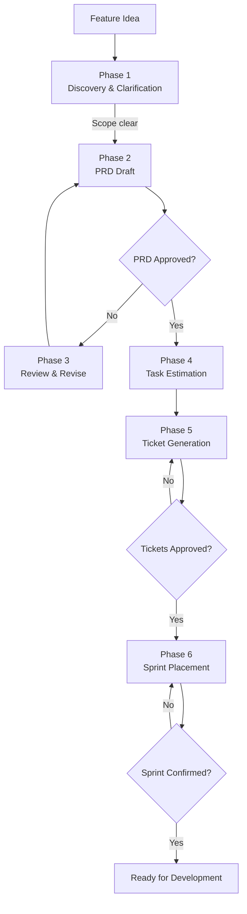
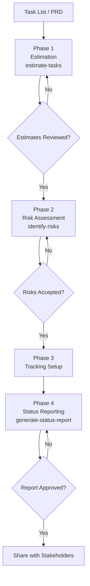
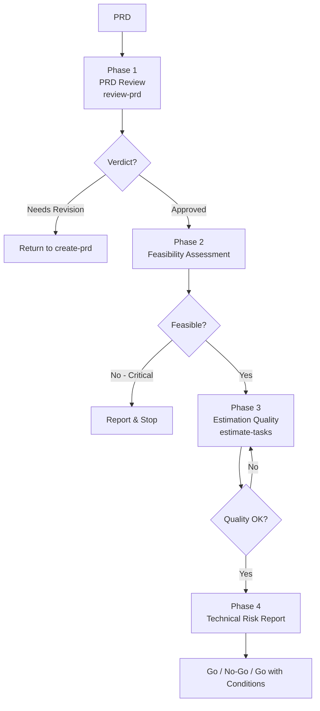
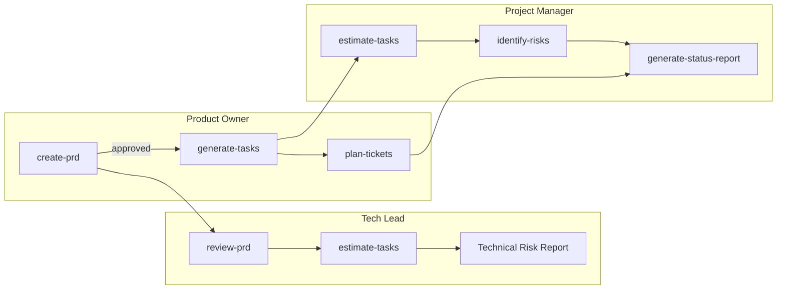
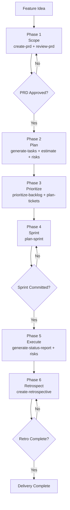
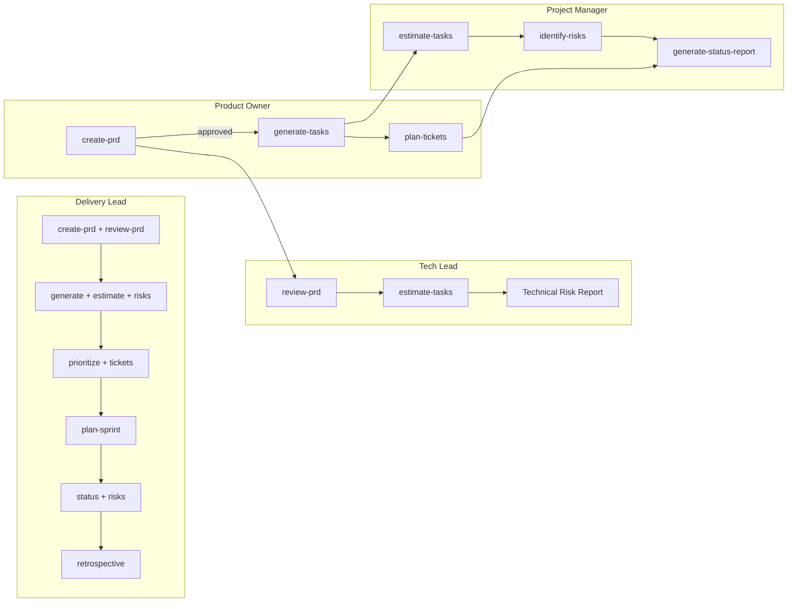

# Persona Guide — Agnostic Planning Skills

Step-by-step workflows for the orchestrating personas.

---

## Product Owner Persona

Orchestrates the full product planning lifecycle: from a feature idea to sprint-ready tickets. Chains three skills through six phases with explicit approval gates.

### Phase Flow

| Phase | Skill | Gate |
|-------|-------|------|
| 1. Discovery & Clarification | — | Scope clear |
| 2. PRD Draft | `create-prd` | — |
| 3. Review & Revise | — | **PRD Approval** |
| 4. Task Estimation | `generate-tasks` | — |
| 5. Ticket Generation | `plan-tickets` | **Ticket Approval** |
| 6. Sprint Placement | — | **Sprint Confirmation** |

**Dependencies:** `create-prd`, `generate-tasks`, `plan-tickets`

---

## Project Manager Persona

Orchestrates execution tracking: from task estimation through risk assessment to stakeholder status reports. Chains three skills through four phases with approval gates.

### Phase Flow

| Phase | Skill | Gate |
|-------|-------|------|
| 1. Estimation | `estimate-tasks` | **Estimation Review** |
| 2. Risk Assessment | `identify-risks` | **Risk Acceptance** |
| 3. Tracking Setup | — | Quality Check |
| 4. Status Reporting | `generate-status-report` | **Status Report Approval** |

**Dependencies:** `estimate-tasks`, `identify-risks`, `generate-status-report`

---

## Tech Lead Persona

Orchestrates technical review of a PRD: evaluates completeness, feasibility, and estimation quality. Produces a go/no-go recommendation. Chains two skills through four phases.

### Phase Flow

| Phase | Skill | Gate |
|-------|-------|------|
| 1. PRD Review | `review-prd` | Decision: Approved / Needs Revision |
| 2. Feasibility Assessment | — | **PRD Feasibility** |
| 3. Estimation Quality | `estimate-tasks` | **Estimation Quality** |
| 4. Technical Risk Report | — | Go/No-Go recommendation |

**Dependencies:** `review-prd`, `estimate-tasks`

---

## Full Planning + Execution Pipeline

---

## Delivery Lead Persona

Meta-persona orchestrating the full delivery pipeline: from feature idea through execution to retrospective. Chains skills through six phases with approval gates.

### Phase Flow

| Phase | Skills | Gate |
|-------|--------|------|
| 1. Scope | `create-prd`, `review-prd` | **PRD Approval** |
| 2. Plan | `generate-tasks`, `estimate-tasks`, `identify-risks` | Quality Check |
| 3. Prioritize | `prioritize-backlog`, `plan-tickets` | — |
| 4. Sprint | `plan-sprint` | **Sprint Commitment** |
| 5. Execute | `generate-status-report`, `identify-risks` | — |
| 6. Retrospect | `create-retrospective` | **Retrospective Complete** |

**Dependencies:** All 10 skills

---

## Full Pipeline Diagram

---

## See Also

- [Skill Catalog](reference/skill-catalog.md) — All skills and personas
- [Integration Matrix](reference/integration-matrix.md) — Complete chaining reference
