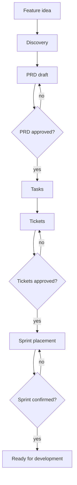
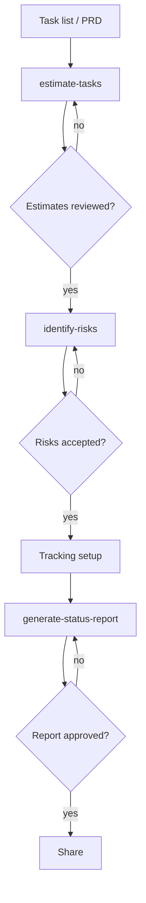
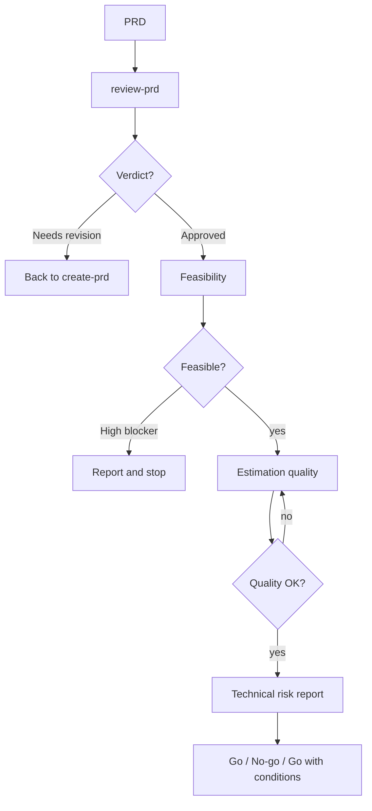
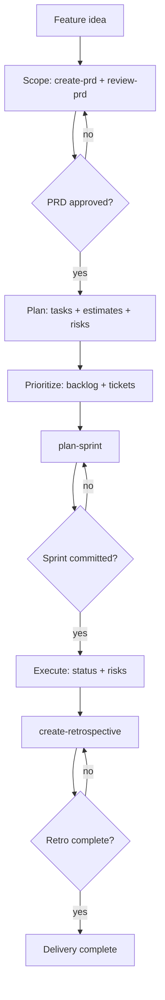

# Persona Guide

Index of the four orchestrators. Phase steps and gates live in each persona `SKILL.md` — one owner.

| Persona | Use when | Path |
|---------|----------|------|
| `product-owner` | Feature needs discovery → PRD → tasks → tickets → sprint | [SKILL.md](../skills/product-owner/SKILL.md) |
| `project-manager` | Sprint or project needs estimates, risks, and a status report | [SKILL.md](../skills/project-manager/SKILL.md) |
| `tech-lead` | PRD needs a technical go/no-go | [SKILL.md](../skills/tech-lead/SKILL.md) |
| `delivery-lead` | Full cycle from PRD through retrospective | [SKILL.md](../skills/delivery-lead/SKILL.md) |

## product-owner

## project-manager

## tech-lead

## delivery-lead

## See also

- [Skill catalog](reference/skill-catalog.md)
- [Integration matrix](reference/integration-matrix.md)

## Composition and resume

Existing names and `type: persona` remain compatible with installed consumers. Product owner, project manager, and tech lead own planning outcomes; delivery lead coordinates the delivery workflow. The composed developer profiles load implementation skills from their authoritative stack packs.

An approved PRD or concrete authorized brief supplies scope. Reuse prior authorization; small bugs go directly to a developer's bug-fix workflow. The [delivery checkpoint contract](../skills/personas/delivery-lead/SKILL.md#authorization-and-checkpoints) carries acceptance criteria, skill identities, evidence, and blockers across handoffs. A missing required skill blocks the dependent step and names the installation repair; optional gaps are disclosed.

Install or roll back using a pinned pack commit and its matching composed bundle. Existing planning skill names and paths are unchanged; avoid mixing versions of templates and their calling skills.
