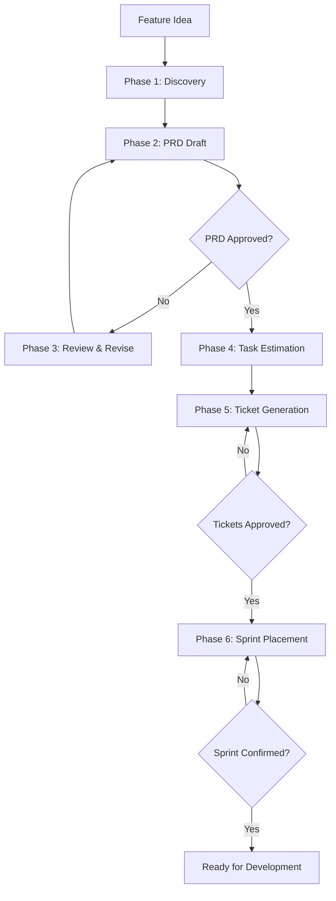
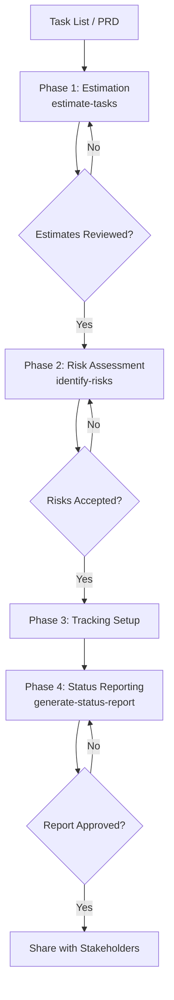

# Integration Matrix — Agnostic Planning Skills

Integration matrix: which skill connects to which and in what order.

---

## Format

- `A → B` means: after A, B typically follows
- `[gate]` indicates mandatory approval gate

---

## Complete Agent Loops

### Product Owner (Planning Lifecycle)



### Project Manager (Execution Tracking)



---

## Full Pipeline

```text
create-prd → review-prd → [gate: PRD approved] → generate-tasks → estimate-tasks → identify-risks → prioritize-backlog → plan-tickets → plan-sprint → generate-status-report → create-retrospective
```

---

## Integrations by Skill

### create-prd

| Next | When |
|------|------|
| review-prd | Always after PRD draft — review for completeness and feasibility |
| generate-tasks | After PRD reviewed and approved |
| plan-tickets | If tickets needed directly from PRD scope |

### review-prd

| Next | When |
|------|------|
| generate-tasks | After review passes (Approved or Approved with Suggestions) |
| create-prd | If review returns Needs Revision — loop back to re-draft |
| tech-lead | For deeper feasibility and estimation quality assessment |

### generate-tasks

| Next | When |
|------|------|
| estimate-tasks | To assign effort estimates to the task breakdown |
| plan-tickets | If the same initiative needs ticket drafts |

### estimate-tasks

| Next | When |
|------|------|
| identify-risks | After estimation, to assess risks surfaced by high-uncertainty tasks |
| plan-sprint | To select tickets based on capacity vs estimates |

### identify-risks

| Next | When |
|------|------|
| generate-status-report | Include the risk register in stakeholder status updates |
| plan-tickets | If risks reveal new ticket dependencies |
| plan-sprint | Scan sprint plan for dependency and capacity risks |

### plan-tickets

| Next | When |
|------|------|
| prioritize-backlog | After tickets drafted, rank them for sprint selection |
| (Create in tracker) | After ticket drafts approved |
| plan-sprint | Selected tickets feed into sprint planning |

### prioritize-backlog

| Next | When |
|------|------|
| plan-sprint | Use ordered backlog to select sprint candidates |
| plan-tickets | If newly prioritized items need ticket drafts |

### plan-sprint

| Next | When |
|------|------|
| generate-status-report | Report sprint progress to stakeholders |
| (Begin implementation) | Start working on sprint tickets |
| create-retrospective | After sprint ends, generate retrospective |

### generate-status-report

| Next | When |
|------|------|
| (Share with stakeholders) | After report approved |
| identify-risks | If report reveals new or escalating risks |
| create-retrospective | Status reports feed into end-of-sprint retrospective |

### create-retrospective

| Next | When |
|------|------|
| plan-sprint | Action items feed into the next sprint plan |
| project-manager | Feed action items into execution tracking |

---

## Quick Decision Matrix

```text
Have a feature idea?
  └─ create-prd → review-prd → generate-tasks → estimate-tasks

Need to prioritize?
  └─ prioritize-backlog → plan-sprint

Need execution tracking?
   └─ project-manager (persona)

   └─ product-owner (persona)

   └─ tech-lead (persona)

   └─ delivery-lead (persona)

- [Persona Guide](../persona-guide.md) — Persona workflows with Mermaid diagrams
