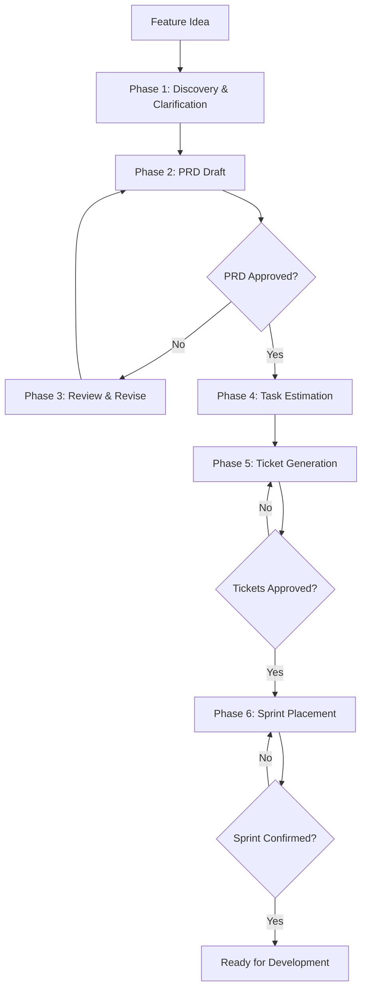

# Integration Matrix — Agnostic Planning Skills

Integration matrix: which skill connects to which and in what order.

---

## Format

- `A → B` means: after A, B typically follows
- `[gate]` indicates mandatory approval gate

---

## Complete Agent Loop

### Product Owner (Full Planning Lifecycle)



### Feature Planning Flow

```text
create-prd → [gate: PRD approved] → generate-tasks → plan-tickets
```

### PRD → Tickets (Direct)

```text
create-prd → [gate: PRD approved] → plan-tickets
```

---

## Integrations by Skill

### create-prd

| Next | When |
|------|------|
| generate-tasks | Always after PRD approved |
| plan-tickets | If tickets needed directly from PRD scope |

### generate-tasks

| Next | When |
|------|------|
| plan-tickets | If the same initiative needs ticket drafts |
| (Begin implementation) | Start working on Task 0.0 |

### plan-tickets

| Next | When |
|------|------|
| (Create in tracker) | After ticket drafts approved |
| (Begin implementation) | After tickets are in the sprint backlog |

---

## Quick Decision Matrix

```text
Have a feature idea?
  └─ create-prd → generate-tasks

Need tickets from an existing plan?
  └─ plan-tickets

Full end-to-end planning?
  └─ product-owner (agent)

Need to revise a PRD?
  └─ create-prd (re-draft) or product-owner Phase 3
```

---

## Checkpoints and Gates

| Name | Type | Defined in | Purpose |
| PRD Approved | gate | create-prd, product-owner | Don't generate tasks without approved PRD |
| Ticket Approved | gate | plan-tickets, product-owner | Don't create tracker issues without explicit approval |
| Sprint Confirmed | gate | product-owner | Don't assume sprint placement without user confirmation |

---

## See Also

- [Skill Catalog](skill-catalog.md) — Complete skills list with descriptions and trigger words
- [Agent Guide](../agent-guide.md) — Product Owner agent phases with Mermaid diagrams
